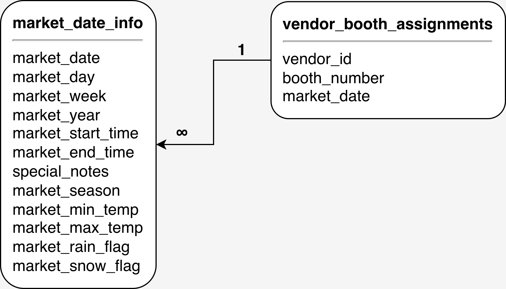

# Assignment 1: Meet the farmersmarket.db and Basic SQL

🚨 **Please review our [Assignment Submission Guide](https://github.com/UofT-DSI/onboarding/blob/main/onboarding_documents/submissions.md)** 🚨 for detailed instructions on how to format, branch, and submit your work. Following these guidelines is crucial for your submissions to be evaluated correctly.

#### Submission Parameters:
* Submission Due Date: `November 05, 2025`
* Weight: 30% of total grade
* The branch name for your repo should be: `assignment-one`
* What to submit for this assignment:
    * This markdown (Assignment1.md) with written responses in Section 4
    * One Entity-Relationship Diagram (preferably in a pdf, jpeg, png format).
    * One .sql file 
* What the pull request link should look like for this assignment: `https://github.com/<your_github_username>/sql/pulls/<pr_id>`
    * Open a private window in your browser. Copy and paste the link to your pull request into the address bar. Make sure you can see your pull request properly. This helps the technical facilitator and learning support staff review your submission easily.

Checklist:
- [ ] Create a branch called `assignment-one`.
- [ ] Ensure that the repository is public.
- [ ] Review [the PR description guidelines](https://github.com/UofT-DSI/onboarding/blob/main/onboarding_documents/submissions.md#guidelines-for-pull-request-descriptions) and adhere to them.
- [ ] Verify that the link is accessible in a private browser window.

If you encounter any difficulties or have questions, please don't hesitate to reach out to our team via our Slack. Our Technical Facilitators and Learning Support staff are here to help you navigate any challenges.

*** 

## Section 1:
You can start this section following *session 1*.

Steps to complete this part of the assignment:
- Load the farmersmarket.db and browse its content
- Create a logical data model
- 

 
If this is your first time in DB Browser for SQLite, the following instructions may help:

#### 1) Load Database
- Open DB Browser for SQLite
- Go to File > Open Database
- Navigate to your farmersmarket.db 
	- This will be wherever you cloned the GH Repo (within the **05_src/sql** folder)
	- 

#### 2) Configure your windows
By default, DB Browser for SQLite has three windows, with four tabs in the main window and three tabs in the bottom right window
- Window 1: Main Window (Centre)
	- Stay in the Database Structure tab for now
- Window 2: Edit Database Cell (Top Right)
- Window 3: Remote (Bottom Right)
	- Switch this to DB Schema tab (very bottom)

Your screen should look like this (or very similar)

#### 3) The farmersmarket.db
There are 10 tables in the Main Window:
1) booth
2) customer
3) customer_purchases
4) market_date_info
5) product
6) product_category
7) vendor
8) vendor_booth_assignments
9) vendor_inventory
10) postal_data

Switch to the Browse Data tab, booth is selected by default

Using the table drop down at the top left, explore some of the contents of the database

Move on to the Logical Data Model task when you have looked through the tables

### Build Logical Data Model

Recall during session 1:

I diagramed the following four tables:
- product
- product_category
- vendor
- vendor_inventory

 

#### Prompt 1:
Choose two tables and create a logical data model. There are lots of tools you can do this (including drawing this by hand), but I'd recommend [Draw.io](https://www.drawio.com/) or [LucidChart](https://www.lucidchart.com/pages/). 

A logical data model must contain:
- table name
- column names
- relationship type

Please do not pick the exact same tables that I have already diagrammed. For example, you shouldn't diagram the relationship between `product` and `product_category`, but you could diagram `product` and `customer_purchases`.

**HINTS**:
- You will need to use the Browse Data tab in the main window to figure out the relationship types.
- You can't diagram tables that don't share a common column
	- These are the tables that are connected
	- 
- The column names can be found in a few spots (DB Schema window in the bottom right, the Database Structure tab in the main window by expanding each table entry, at the top of the Browse Data tab in the main window)

## **MY SUBMISSION**:
- 
- Here, `vendor_booth_assignments` (3 columns) shares a one-to-many relationship with `market_date_info` (12 columns) on `market_date`

***

## Section 2:
You can start this section following *session 2*.

Steps to complete this part of the assignment:
- Open the assignment1.sql file in DB Browser for SQLite:
	- from [Github](./02_activities/assignments/assignment1.sql)
	- or, from your local forked repository  
- Complete each question

### Write SQL

#### SELECT
1. Write a query that returns everything in the customer table.
2. Write a query that displays all of the columns and 10 rows from the customer table, sorted by customer_last_name, then customer_first_ name.

-

#### WHERE
1. Write a query that returns all customer purchases of product IDs 4 and 9.
2. Write a query that returns all customer purchases and a new calculated column 'price' (quantity * cost_to_customer_per_qty), filtered by customer IDs between 8 and 10 (inclusive) using either:
	1.  two conditions using AND
	2.  one condition using BETWEEN

-

#### CASE
1. Products can be sold by the individual unit or by bulk measures like lbs. or oz. Using the product table, write a query that outputs the `product_id` and `product_name` columns and add a column called `prod_qty_type_condensed` that displays the word “unit” if the `product_qty_type` is “unit,” and otherwise displays the word “bulk.”

2. We want to flag all of the different types of pepper products that are sold at the market. Add a column to the previous query called `pepper_flag` that outputs a 1 if the product_name contains the word “pepper” (regardless of capitalization), and otherwise outputs 0.

-

#### JOIN
1. Write a query that `INNER JOIN`s the `vendor` table to the `vendor_booth_assignments` table on the `vendor_id` field they both have in common, and sorts the result by `vendor_name`, then `market_date`.

***

## Section 3:
You can start this section following *session 3*.

Steps to complete this part of the assignment:
- Open the assignment1.sql file in DB Browser for SQLite:
	- from [Github](./02_activities/assignments/assignment1.sql)
	- or, from your local forked repository  
- Complete each question

### Write SQL

#### AGGREGATE
1. Write a query that determines how many times each vendor has rented a booth at the farmer’s market by counting the vendor booth assignments per `vendor_id`.
2. The Farmer’s Market Customer Appreciation Committee wants to give a bumper sticker to everyone who has ever spent more than $2000 at the market. Write a query that generates a list of customers for them to give stickers to, sorted by last name, then first name.
   
**HINT**: This query requires you to join two tables, use an aggregate function, and use the HAVING keyword.

-

#### Temp Table
1. Insert the original vendor table into a temp.new_vendor and then add a 10th vendor: Thomass Superfood Store, a Fresh Focused store, owned by Thomas Rosenthal
   
**HINT**: This is two total queries -- first create the table from the original, then insert the new 10th vendor. When inserting the new vendor, you need to appropriately align the columns to be inserted (there are five columns to be inserted, I've given you the details, but not the syntax)

To insert the new row use VALUES, specifying the value you want for each column:  
`VALUES(col1,col2,col3,col4,col5)`

-

#### Date
1. Get the customer_id, month, and year (in separate columns) of every purchase in the customer_purchases table.
   
**HINT**: you might need to search for strfrtime modifers sqlite on the web to know what the modifers for month and year are!

2. Using the previous query as a base, determine how much money each customer spent in April 2022. Remember that money spent is `quantity*cost_to_customer_per_qty`.
   
**HINTS**: you will need to AGGREGATE, GROUP BY, and filter...but remember, STRFTIME returns a STRING for your WHERE statement!!

*** 

## Section 4:
You can start this section anytime.

Steps to complete this part of the assignment:
- Read the article
- Write, within this markdown file, <1000 words.

### Ethics

Read: Qadri, R. (2021, November 11). _When Databases Get to Define Family._  Wired.  
    https://www.wired.com/story/pakistan-digital-database-family-design/

Link if you encounter a paywall: https://archive.is/srKHV or https://web.archive.org/web/20240422105834/https://www.wired.com/story/pakistan-digital-database-family-design/

**What values systems are embedded in databases and data systems you encounter in your day-to-day life?**

Consider, for example, concepts of fariness, inequality, social structures, marginalization, intersection of technology and society, etc.

***

## Response 
*I hope it's okay that I'm writing this outside the code box - I'd like to include a footnote!* :octocat:

One case is inspired by my current apartment search: It’s been a few years since I’ve had to look for a new place in Toronto, and I see that some “good-to-have” aspects of rental applications in the past—specifically, for the purposes of answering this question, coming to a listing ready with an (excellent) credit check in hand—are now mandatory to be considered for the rental. There are clearly several barriers with this system that touch on all of these concepts, but focusing on the student perspective, the credit system already excludes many students (to state the obvious, it’s really hard to have ideal credit with this cost of living). Students often don’t have long-term jobs, which also makes it difficult to secure loans or other income sources to help with credit. At the graduate student level, for example, we often have to explain that our funding comes through a stipend, teaching assistantships, odd jobs, grants, and/or other sources, and that many of these sources are renewed on a year-by-year contract rather than appearing as steady income sources over the program.

Another case I’m seeing lately is in my postdoctoral research fellowship applications. Specifically, many of the CV forms provided by granting agencies are designed around inputting academic experience, with little or no room for listing and elaborating on non-academic work experience, which, in my view, is just as important as academic experience. For example, I had an industry career for a few years between my undergraduate and graduate degrees, and I don’t have any room for elaboration on these points in many application forms (if I am even able to list them). These systems don’t feel flexible and often leave me uncertain about my application, and like I don’t have the “right experience” to fill them out, and like a huge part of my experience is missing. Pulling from the article, the point that “good database design does not need to predict what will happen 20 years in the future, but needs to acknowledge there will be change” can be extended further: Good design should also consider a much broader, more inclusive set of users with diverse backgrounds and pathways. Providing opportunities to discuss non-academic experience in these applications at the CV form level allows that experience to be at the front of the application and entered into a dedicated database, rather than being buried in later pages of written materials that may or may not be read with the same depth.

 Along similar lines, in a recent postdoc application through a federal Canadian funding agency, I was only able to input one field of study from my undergraduate studies at U of T, and it was difficult to choose one of the two majors and a minor that I completed. As a Psychology PhD candidate, I opted to list my Psychology major, but my Philosophy major was just as formative to my current research program and explains why I completed an undergraduate thesis in Philosophy, which I had to list in the form. U of T’s undergraduate system allows for several combinations of specialist/major/minor programs; given that 80,573 undergraduate students were enrolled at U of T the 2024-25 year[^1], I’m guessing my issue is a very widespread problem, even beyond those applying from outside of U of T. This might be nitpicky as applicants are usually able to expand on their experience in the written materials, but like the previous point, I still felt as if I omitted a huge part of my story up front. I worry that reviewers may overlook a critical piece of information when reading my research proposal, which outlines how philosophical concepts inform my research questions, especially since the document mentioning and detailing my background in Philosophy comes several pages later.

[^1]: from [here!](https://www.utoronto.ca/about-u-of-t/quick-facts)

